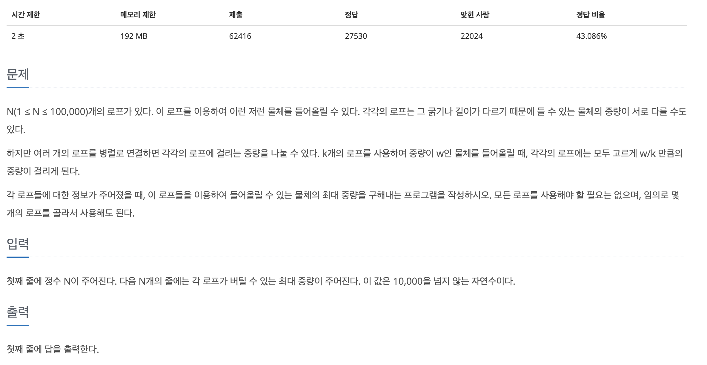

# 👨🏻‍💻 1월 1주차 코딩테스트(그리디) 👨🏻‍💻

### 💡1번문제 : 2217번(로프)

### 1차 문제 접근 방식

- 주어진 배열을 오름차순으로 정렬한다.
- 정렬이 되었을 경우, 해당 무게를 들어올릴 수 있는 로프x 나머지 로프 수를 곱해준다.

**결과 : 정답!!**

### 다른 풀이 방법

접근 한 방식과 동일!!

### 💡2번문제 :

### 1차시도

### 해결방법

### 💡3번문제 :

### 1차시도

### 해결방법
